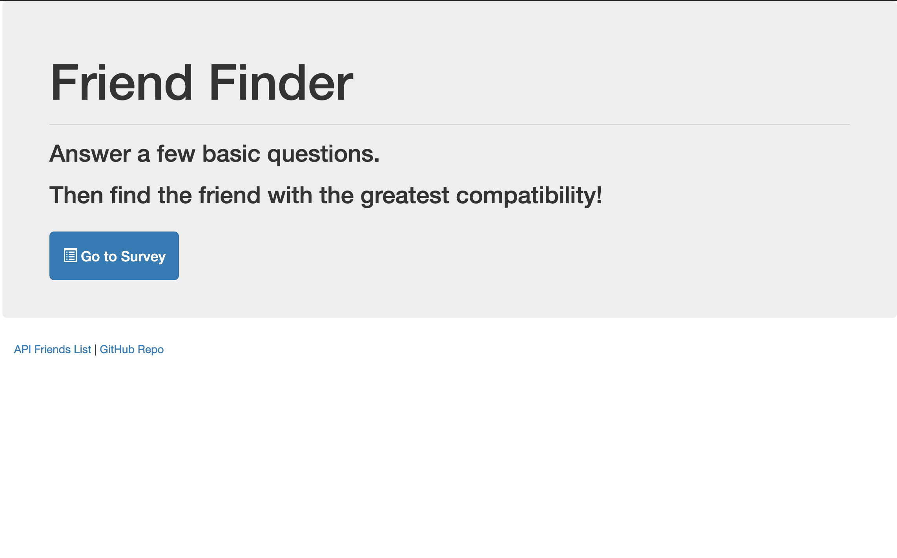
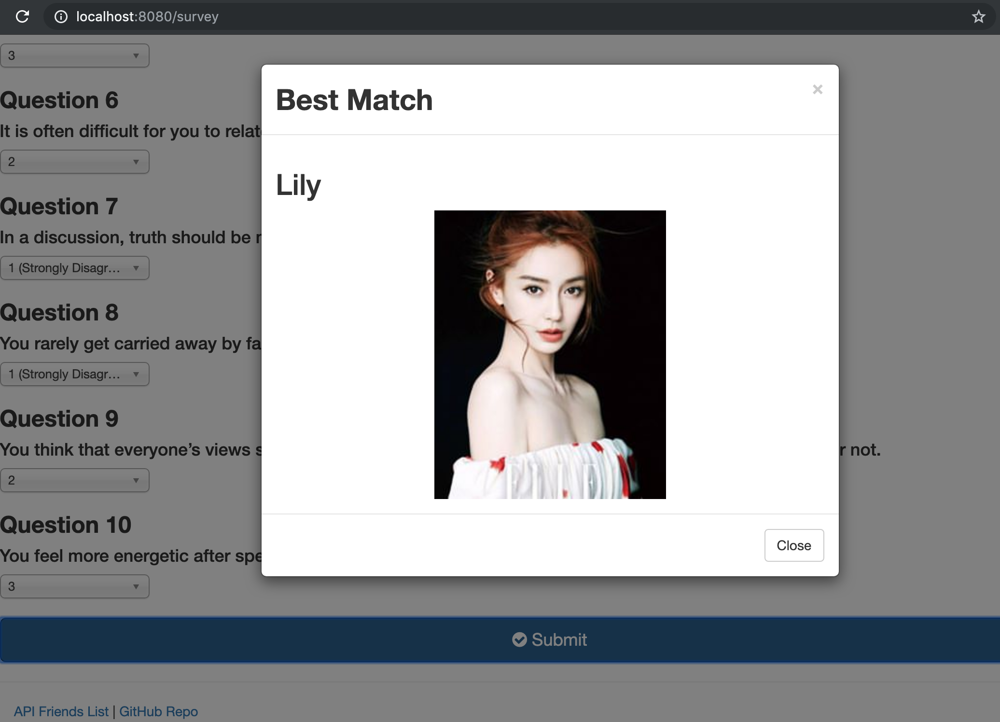

# FriendFinder

This is a compatibility-based application, a full-stack site that takes in users' survey results, compares the answers and displays the name and picture of the user with the best overall match.

This is my **Node and Express Servers** Assignment in Gatech Coding bootcamp.

### The demo version of the site is offered by Coding bootcamp (https://friend-finder-fsf.herokuapp.com/)

You can click "Go to Survey", and try to find your best match.
### Good Luck!

 
